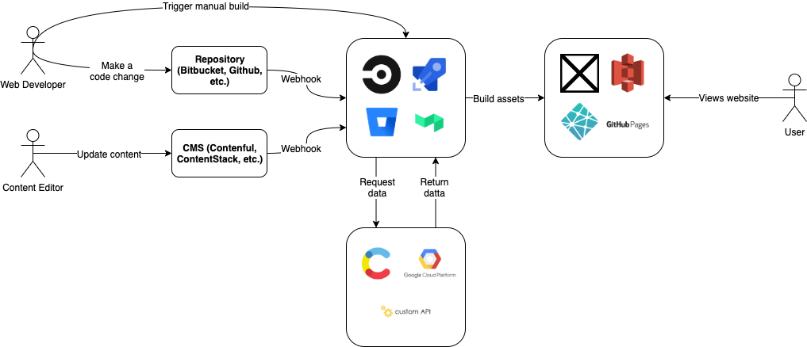

# GatsbyJS

---
# How do we build content driven websites in 2020?

We have 3 main ways

---
# Dynamic on Server

---
### Dynamic on Server

* We build templates for the website, then when the site is requested it will generate the sites HTML and serve that to the client.
* It can take time to render the page on the server
* It’s tougher to scale and you might have some performance issues.

---
# Dynamic on Device

---
### Dynamic on Device

* Instead of generating the HTML on the server, why don't we save money and run this on the user's device?
* Fast page loads because the server only has to serve static files (easier to scale)
* Often results in situations where the site is not useable for the first few seconds.
* SEO issues

---
# Static Site Generation

---
### Static Site Generation
Instead of updating the website content on each request, we only update the site content when the content changes.

---

---
## Static Site Generation

### Pros
* Fast to load as it can be served directly off a CDN
* Really low costs - no horizontal scaling needed
* SEO is a lot easier

---
## Static Site Generation

### Cons
* Potentially will be serving stale data – not great for projects where having the most up to date data is critical
* Build required each time you update your content
* Mostly used for sites that are largely content-driven

---
# Which static site generator should I use?

---
### Which one?

* Hugo – GoLang SSG
* Eleventy – VanillaJS SSG
* VuePress – VueJS SSG
* Middleman – Ruby SSG
* __Gatsby__ – React SSG
