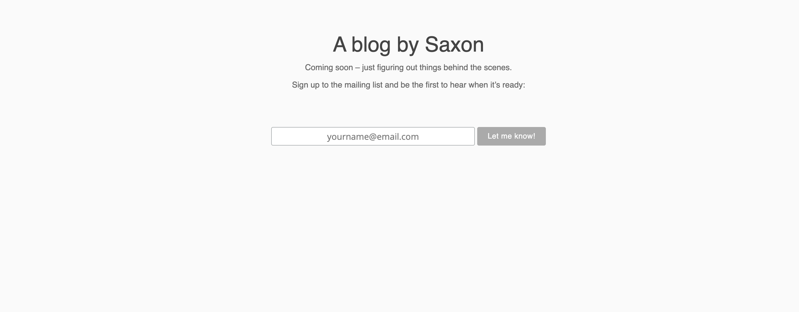

# Let's build a website using Gatsby

What should I build?

---


---
# Who wants to help me build Saxon's blog using Gatsby?

---
# What do I have?

---
1. Default GatsbyJS starter site

```
$ gatsby new saxon-blog
```

---
2. A few standard plugins installed

```
$ npm install --save gatsby-source-contentful
```

---
3. A CMS with some blog content on it

---
4. A few basic components

---
5. The link to Saxon's Github

